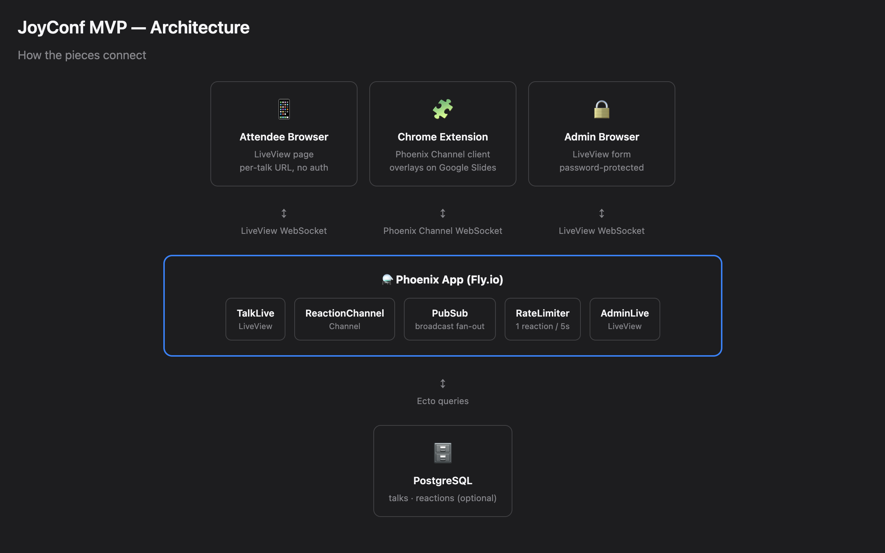
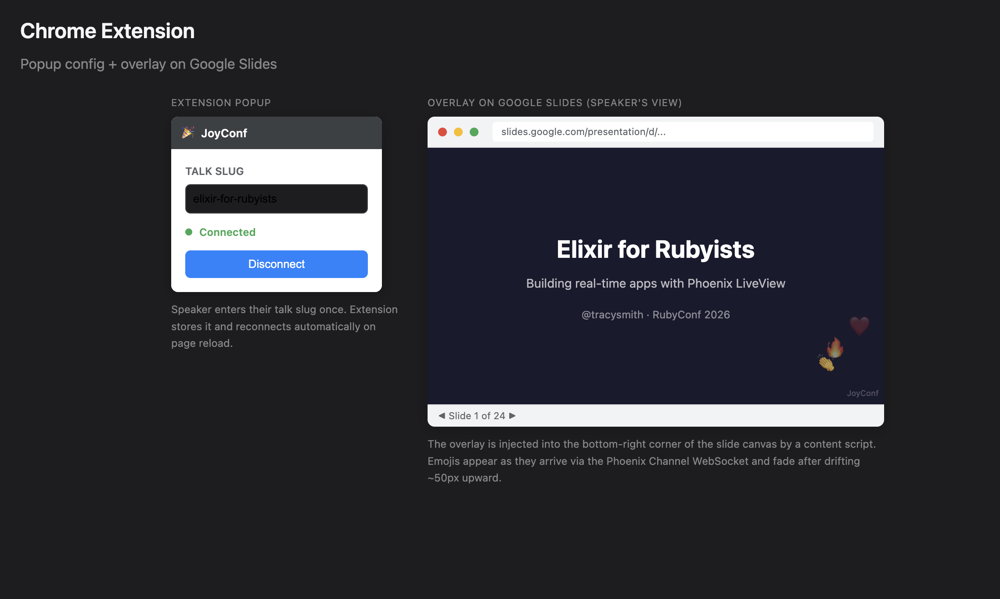

# JoyConf

Live emoji reactions for conference talks. Attendees send reactions from their
phones; emojis float on their screens and overlay the speaker's Google Slides
presentation via a Chrome extension.

## How it works

1. Speaker creates a talk in the admin panel → gets a QR code
2. Attendees scan the QR code → land on `/t/<slug>` → tap emojis
3. Reactions broadcast in real time via Phoenix PubSub
4. Chrome extension connected to the same talk slug shows floating emoji overlay on Google Slides
5. Speaker starts a session from the extension (or via the channel) — reactions are persisted with a slide number
6. After the talk, the admin analytics view shows per-slide reaction breakdowns; sessions from the same talk can be compared side-by-side

For a full explainer on the technical implementation see [this explainer](docs/explainer.md).
For the story of writing the project (the whys and the bugs), see [this blog post](https://tracyatteberry.com/posts/joyconf/).

---



---



---

## Running locally

### Prerequisites

- Elixir 1.14+ / Erlang 26+
- PostgreSQL running locally
- Node.js (for asset building, handled by Mix)

### Setup

```bash
mix setup        # installs deps, creates & migrates DB, builds assets
mix phx.server   # starts the server at http://localhost:4000
```

The admin panel is at `http://localhost:4000/admin`. Use HTTP Basic Auth with
any username and password `devpassword` (the dev default set in
`config/dev.exs`).

### Running tests

```bash
mix test                        # run all Elixir tests
mix test test/path/to/file.exs  # run a single test file
mix test --failed               # re-run only previously failing tests
```

The Chrome extension has its own Jest test suite:

```bash
cd extension
npm install
npm test        # run all Jest tests
```

### End-to-end test flow

1. Start the server: `mix phx.server`
2. Go to `http://localhost:4000/admin/talks/new`
3. Enter a title (slug auto-generates from title), click **Create Talk**
4. A QR code appears — note the slug (e.g. `my-talk`)
5. Open `http://localhost:4000/t/my-talk` in another tab
6. Tap an emoji — it should float up on the attendee page
7. (Optional) Load the Chrome extension pointed at `my-talk` and open a Google Slides presentation to see the overlay
8. (Optional) In the extension popup, click **Start Session** — reactions are now persisted with slide numbers
9. After tapping some emojis, go to `http://localhost:4000/admin` → select the talk → click **Analytics** next to the session to see the per-slide breakdown

---

## Chrome extension

### Install (developer mode)

1. Open `chrome://extensions` in Chrome
2. Enable **Developer mode** (top-right toggle)
3. Click **Load unpacked** → select the `extension/` directory in this repo
4. The JoyConf icon appears in the toolbar

### Connect to a talk

1. Navigate to a Google Slides presentation (`https://docs.google.com/presentation/...`)
2. Click the JoyConf extension icon
3. Enter the talk slug (e.g. `elixir-for-rubyists`)
4. Click **Connect** — the dot turns green when connected

The extension auto-reconnects on page reload if a slug was previously saved.

### Pointing at a different server

The extension is hard-coded to `wss://joyconf.fly.dev` in `extension/content/content.js`:

```javascript
const HOST = "wss://joyconf.fly.dev";
```

Change this to `ws://localhost:4000` for local testing, then:

1. Reload the extension in `chrome://extensions` (click the refresh icon)
2. **Reload the Google Slides tab** — Chrome does not re-inject content scripts into already-open tabs when an extension is updated

To debug connection issues, open Chrome DevTools on the Google Slides tab (F12) and check the **Console** for `[JoyConf]` log messages.

---

## Changing the emoji set

Edit the `@emojis` module attribute in `lib/joyconf_web/live/talk_live.ex`:

```elixir
@emojis ["❤️", "😂", "🔥", "👏", "🤯"]
```

Add, remove, or reorder emojis here. No other changes needed — the template loops over this list.

---

## Deploying to Fly.io

### First-time setup

```bash
fly auth login
fly launch --name joyconf --region iad --no-deploy
fly secrets set SECRET_KEY_BASE=$(mix phx.gen.secret)
fly secrets set ADMIN_PASSWORD=choose-a-strong-password
fly deploy
```

### Subsequent deploys

```bash
fly deploy
```

Migrations run automatically on each deploy (configured in `fly.toml` via `[deploy] release_command`).

### Setting / resetting the admin password

```bash
fly secrets set ADMIN_PASSWORD=new-strong-password
fly deploy   # restart the app to pick up the new secret
```

The password takes effect after the next deploy (Fly restarts the app when
secrets change, but the config is read at boot via `Application.get_env`).

To verify the current secret is set (without revealing it):

```bash
fly secrets list
```

---

## Project structure

| Path                                              | What it does                                                   |
| ------------------------------------------------- | -------------------------------------------------------------- |
| `lib/joyconf/talks.ex`                            | Context: talks + session lifecycle (start, stop, rename, etc.) |
| `lib/joyconf/talks/talk.ex`                       | Ecto schema + changeset validation                             |
| `lib/joyconf/talks/talk_session.ex`               | TalkSession schema (label, started_at, ended_at)               |
| `lib/joyconf/reactions.ex`                        | Context: create reactions, per-slide totals query              |
| `lib/joyconf/reactions/reaction.ex`               | Reaction schema (emoji, slide_number, talk_session_id)         |
| `lib/joyconf/rate_limiter.ex`                     | ETS-backed GenServer: 1 reaction per session per 5s            |
| `lib/joyconf/qr_code.ex`                          | Wraps `eqrcode` → base64 PNG data URI                          |
| `lib/joyconf_web/live/admin_live.ex`              | Admin panel: talks, QR codes, sessions panel                   |
| `lib/joyconf_web/live/session_analytics_live.ex`  | Per-session analytics: slide breakdown + comparison mode       |
| `lib/joyconf_web/live/talk_live.ex`               | Attendee page: emoji buttons, stamps reactions with slide      |
| `lib/joyconf_web/channels/reaction_channel.ex`    | Channel: reactions, session start/stop, slide_changed          |
| `lib/joyconf_web/plugs/admin_auth.ex`             | HTTP Basic Auth plug for `/admin` routes                       |
| `assets/js/hooks/emoji_buttons.js`                | Client-side 5s cooldown UI                                     |
| `assets/js/hooks/emoji_stream.js`                 | Floating emoji animation on `new_reaction` event               |
| `extension/`                                      | Chrome Manifest V3 extension                                   |
| `extension/adapters/`                             | Adapter registry + Google Slides slide-number reader           |

