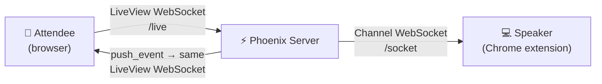
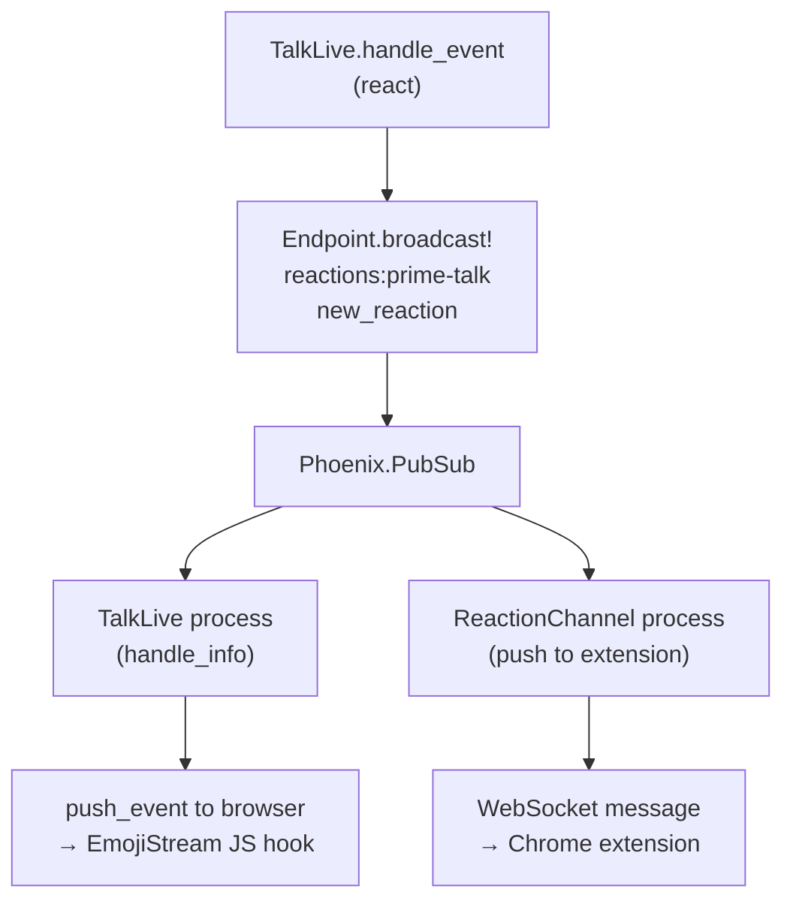
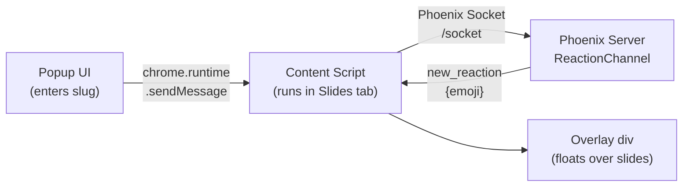
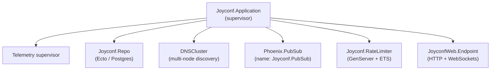

# JoyConf — How it works

JoyConf lets conference attendees send live emoji reactions that float up on
the speaker's screen in real time. This document walks through how the whole
system fits together, with a focus on the communications plumbing.

---

## The big picture

There are three actors in the system:

1. **Attendee** — opens a URL on their phone (`/t/:slug`), taps an emoji
2. **Phoenix server** — receives the tap, rate-limits it, and broadcasts it
3. **Speaker** — has a Chrome extension running on their laptop that receives
   the broadcast and overlays emojis onto their slide presentation



Two different WebSocket connections are used:

| Connection      | Path      | Protocol         | Used by            |
| --------------- | --------- | ---------------- | ------------------ |
| LiveView socket | `/live`   | Phoenix LiveView | Attendee's browser |
| Channel socket  | `/socket` | Phoenix Channel  | Chrome extension   |

---

## Project structure

```
lib/
  joyconf/
    application.ex        # OTP supervision tree
    talks.ex              # Talk context (CRUD, slug generation)
    talks/talk.ex         # Ecto schema
    rate_limiter.ex       # GenServer + ETS rate limiting
    qr_code.ex            # QR code generation for admin
  joyconf_web/
    live/
      talk_live.ex        # Attendee reaction page (LiveView)
      admin_live.ex       # Admin: create talks, view QR codes
    channels/
      user_socket.ex      # Socket definition for Chrome extension
      reaction_channel.ex # Channel for extension to receive reactions
    plugs/
      admin_auth.ex       # Basic auth for /admin routes
    endpoint.ex           # Mounts both socket types
    router.ex             # Route definitions

extension/
  content/content.js      # Content script: WebSocket + emoji overlay
  popup/popup.{html,js}   # Extension popup UI
  manifest.json

assets/js/hooks/
  emoji_buttons.js        # Disables buttons + shows cooldown countdown
  emoji_stream.js         # Animates incoming emojis in the browser
```

---

## The data model

There's one database table: `talks`.

```elixir
schema "talks" do
  field :title, :string   # e.g. "Prime talk"
  field :slug,  :string   # e.g. "prime-talk"  ← used in URL and PubSub topic
  timestamps(type: :utc_datetime)
end
```

Slugs are auto-generated from the title (lowercase, spaces → hyphens, special
chars stripped) and are unique. The slug is the key that ties all three actors
together. It's in the URL, the PubSub topic name, and the Channel topic name.

---

## Routing

```elixir
# Public attendee page
scope "/t" do
  live "/:slug", TalkLive
end

# Admin (HTTP Basic Auth required)
scope "/admin" do
  pipe_through [:browser, :admin]
  live "/",          AdminLive, :index
  live "/talks/new", AdminLive, :new
end
```

---

## The full emoji journey

This is the core flow. What happens from tap to floating emoji on the speaker's screen.


### Step by step

**1. Attendee taps a button**

The template uses `phx-click="react"` and `phx-value-emoji="🔥"`. Phoenix
LiveView sends this over the existing WebSocket to `TalkLive.handle_event/3` on
the server. No HTTP request is made.

**2. Rate limiting**

```elixir
def handle_event("react", %{"emoji" => emoji}, socket) do
  if RateLimiter.allow?(socket.id) do
    Endpoint.broadcast!("reactions:#{socket.assigns.talk.slug}", "new_reaction", %{emoji: emoji})
  end
  {:noreply, socket}
end
```

`RateLimiter` uses an ETS table (an in-memory key/value store built into the
BEAM) to track the last reaction time per session. If less than 3 seconds have
passed, the event is silently dropped.

**3. Broadcasting**

`Endpoint.broadcast!/3` sends the message through `Phoenix.PubSub` to *all
subscribers* of the topic `"reactions:prime-talk"`. Two things are subscribed:

- **The LiveView process itself** (subscribed during `mount/3`)
- **Any ReactionChannel processes** (subscribed when the extension joins)

**4a. Back to the attendee's browser**

`TalkLive.handle_info/2` receives the broadcast and pushes a client-side event:

```elixir
def handle_info({:new_reaction, emoji}, socket) do
  {:noreply, push_event(socket, "new_reaction", %{emoji: emoji})}
end
```

The `EmojiStream` JS hook picks this up and animates a floating emoji in the attendee's browser.

**4b. To the speaker's Chrome extension**

`ReactionChannel` also receives the PubSub broadcast and relays it directly to
the WebSocket channel. The extension's content script receives it and calls
`spawnEmoji()`, which creates a floating `<span>` over the slide presentation.

---

## The two websocket connections in detail

### LiveView socket (`/live`)

This powers the attendee's interactive page. Phoenix LiveView manages it
automatically so no manual setup is needed. It handles:

- Sending `phx-click` events from the browser to the server
- Receiving `push_event` calls from the server to run client-side JS hooks
- Keeping the page in sync (diffs)

Configured in `endpoint.ex`:
```elixir
socket "/live", Phoenix.LiveView.Socket,
  websocket: [connect_info: [session: @session_options]]
```

### Channel socket (`/socket`)

This is a bare Phoenix Channel socket, lower-level than LiveView. It's used by
the Chrome extension because the extension isn't a web page; it can't use
LiveView. It only needs to *receive* messages, which Channels handle perfectly.

```elixir
# user_socket.ex
defmodule JoyconfWeb.UserSocket do
  use Phoenix.Socket
  channel "reactions:*", JoyconfWeb.ReactionChannel

  def connect(_params, socket, _info), do: {:ok, socket}
  def id(_socket), do: nil
end
```

The `"reactions:*"` pattern means the extension can join any topic matching
that prefix (e.g. `"reactions:prime-talk"`).

`check_origin: false` is set on this socket (in `endpoint.ex`) so that the
Chrome extension, which runs from a `chrome-extension://` origin, is allowed
to connect.

```elixir
# endpoint.ex
socket "/socket", JoyconfWeb.UserSocket,
  websocket: [check_origin: false]
```

### Why does PubSub connect them?

`Endpoint.broadcast!/3` doesn't know or care whether subscribers are LiveView
processes or Channel processes. It just sends a message to everyone subscribed
to the topic. This is what makes the architecture clean. The `handle_event` in
`TalkLive` doesn't need to know the extension exists.



---

## Rate limiting

The `RateLimiter` is a `GenServer` that owns an ETS table. ETS (Erlang Term
Storage) is like a very fast, in-memory hash map built into the BEAM runtime.

```elixir
defmodule Joyconf.RateLimiter do
  use GenServer

  @cooldown_ms 3_000
  @table :rate_limiter

  def allow?(session_id) do
    now = System.monotonic_time(:millisecond)

    case :ets.lookup(@table, session_id) do
      [{^session_id, last_at}] when now - last_at < @cooldown_ms ->
        false   # too soon
      _ ->
        :ets.insert(@table, {session_id, now})
        true    # allowed — record the timestamp
    end
  end
end
```

The key design choice here is `:public` + `read_concurrency: true` on the ETS
table. This means any process can call `allow?/1` directly without going
through the GenServer. The GenServer just owns the table's lifetime. This
avoids making the GenServer a bottleneck when many attendees are tapping at
once.

The session ID used is `socket.id`, which Phoenix assigns to each LiveView
connection. This means each browser tab gets its own rate limit bucket.

There's also a *client-side* rate limit in `emoji_buttons.js`. Buttons are
disabled for 3 seconds with a visible countdown. This is just UX; the real
enforcement is server-side.

---

## The Chrome extension

The extension has two parts:

**Popup (`popup.html` + `popup.js`)** — A small UI that appears when you click
the extension icon. The speaker enters the talk slug and clicks "Connect". The
popup sends a message to the content script via `chrome.runtime.sendMessage`.

**Content script (`content.js`)** — Injected into Google Slides pages. It:

1. Connects a Phoenix `Socket` to `wss://joyconf.fly.dev/socket`
2. Joins the `reactions:${slug}` channel
3. Listens for `"new_reaction"` messages and calls `spawnEmoji()`



One tricky detail: when the speaker enters fullscreen mode in Google Slides,
the browser creates a new stacking context for the fullscreen element.  Any
`position: fixed` elements on `<body>` become invisible. The extension handles
this by re-parenting the overlay `<div>` into the fullscreen element when a
`fullscreenchange` event fires:

```javascript
document.addEventListener("fullscreenchange", () => {
  const overlay = document.getElementById("joyconf-overlay");
  if (document.fullscreenElement) {
    document.fullscreenElement.appendChild(overlay); // move into fullscreen
  } else {
    document.body.appendChild(overlay);              // move back
  }
});
```

---

## LiveView mount and subscription

When an attendee navigates to `/t/prime-talk`, Phoenix renders `TalkLive`. The
`mount/3` callback runs twice: once server-side for the initial HTML render,
and once after the WebSocket connects:

```elixir
def mount(%{"slug" => slug}, _session, socket) do
  talk = Talks.get_talk_by_slug(slug)

  if connected?(socket) do
    Endpoint.subscribe("reactions:#{slug}")
  end

  {:ok, assign(socket, talk: talk, emojis: ["❤️", "😂", "🔥", "👏", "🤯"])}
end
```

`connected?(socket)` is `false` on the first (HTTP) render and `true` after the
WebSocket upgrades. Subscribing only when connected avoids duplicate
subscriptions and wasted work during the initial render.

If the slug doesn't exist in the database, the LiveView redirects to the home page:

```elixir
case Talks.get_talk_by_slug(slug) do
  nil  -> {:ok, push_navigate(socket, to: ~p"/")}
  talk -> {:ok, assign(socket, talk: talk, ...)}
end
```

---

## Admin flow

The admin panel at `/admin` is protected by HTTP Basic Auth (`AdminAuth` plug).
From there, an organiser can:

1. Create a talk: enter a title, the slug is auto-generated
2. Get a QR code: the `QRCode` module wraps `EQRCode` to generate a PNG
   encoded as a base64 data URI, ready to embed in an `` tag or download

The QR code encodes the full attendee URL
(`https://joyconf.fly.dev/t/prime-talk`), so speakers can display it on their
first slide.

---

## Supervision tree

Every long-lived process in Elixir/OTP lives under a supervisor. Here's
JoyConf's:



If `RateLimiter` crashes, the supervisor restarts it automatically. When it
restarts, the ETS table is recreated empty and this is fine, it just means the
cooldown state is lost and everyone gets a fresh window to react.

---

## Key concepts recap

| Concept                 | What it does in JoyConf                                                         |
| ----------------------- | ------------------------------------------------------------------------------- |
| **LiveView**            | Powers the attendee tap page; manages WebSocket lifecycle automatically         |
| **Phoenix Channel**     | Lower-level WebSocket used by the Chrome extension to receive events            |
| **PubSub**              | The message bus; `broadcast!` sends to all subscribers regardless of type       |
| **GenServer**           | The RateLimiter is a GenServer that owns an ETS table                           |
| **ETS**                 | Fast in-memory storage for rate limit timestamps; bypasses GenServer bottleneck |
| **phx-hook**            | Bridges server events to client-side JavaScript (EmojiStream, EmojiButtons)     |
| **push_event**          | Server → client event delivery over the LiveView socket                         |
| **check_origin: false** | Allows the Chrome extension (different origin) to open a socket                 |

